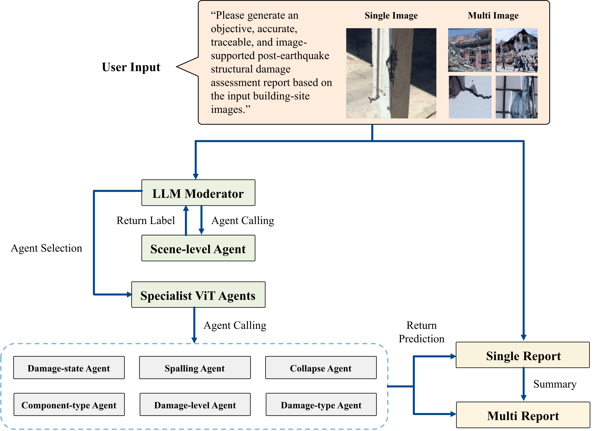
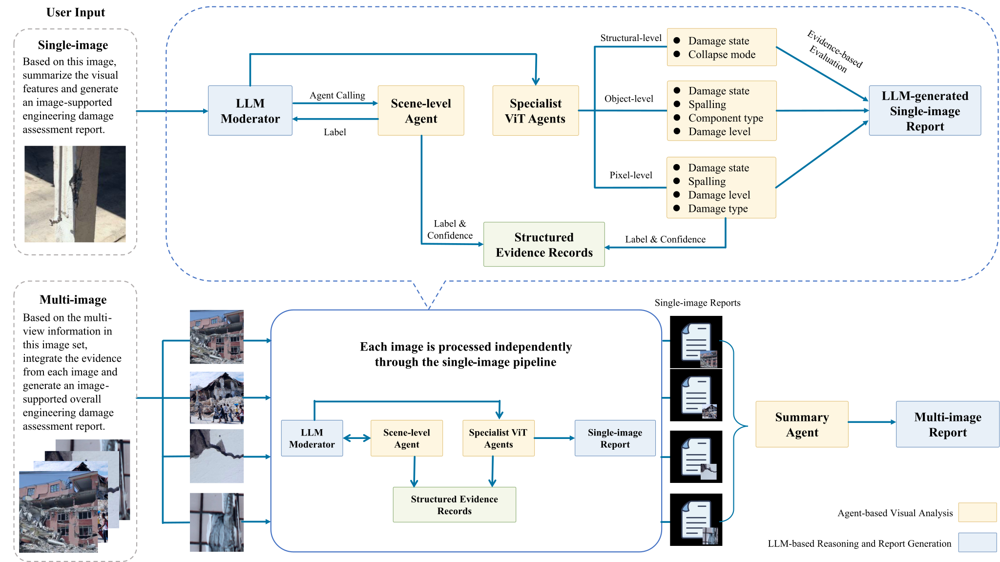
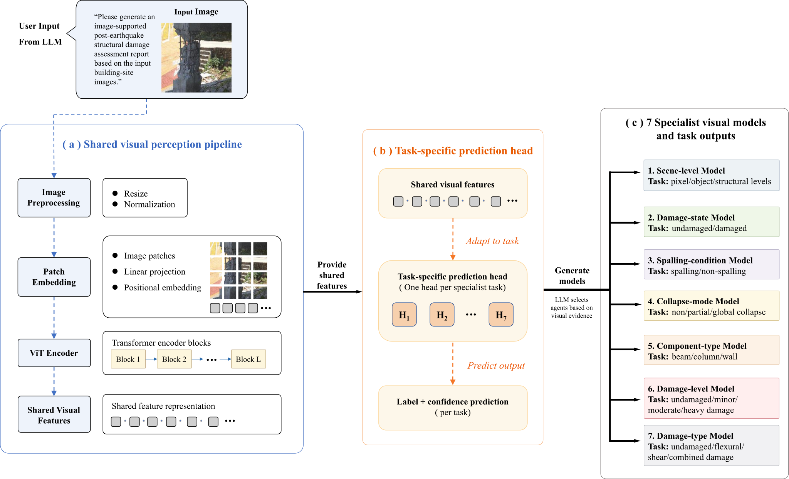
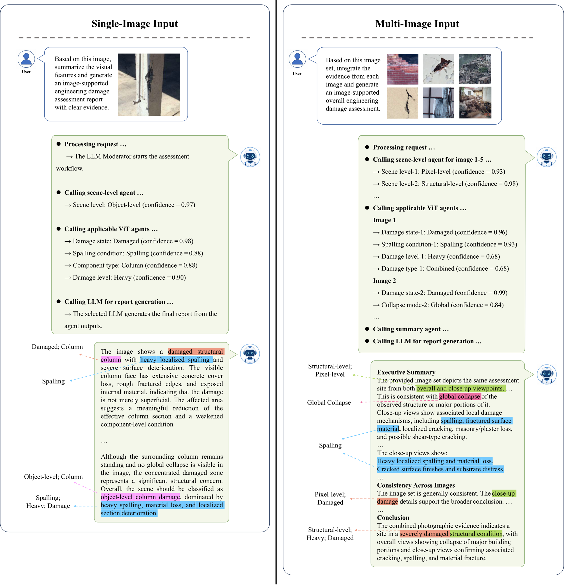
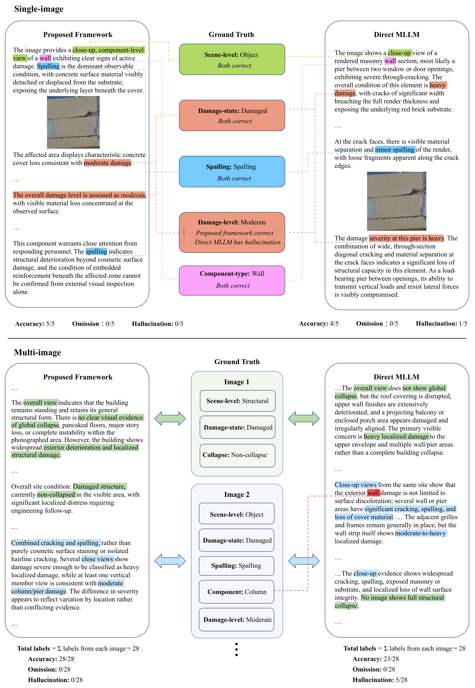

# SeismicAgent

### Multi-Agent Large Language Model Framework for Multi-Scale Post-Earthquake Structural Damage Assessment

**Ye Yuan1,2 · Yuzhou Qie2 · Long Chen1,* · Qiuchen Lu3 · Nan Li4 · Dong Yang5 · Mou Ben6**

1 City University of Hong Kong · 2 The Hong Kong Polytechnic University · 3 University College London  
4 Tsinghua University · 5 Guangzhou University · 6 Central South University

**Accurate perception · Scene-adaptive orchestration · Evidence-grounded reporting**

> **Source code will be released once the paper is accepted.**

  

<em>Overall architecture of SeismicAgent. An LLM moderator coordinates the scene-level agent and specialist ViT agents, while single-image and multi-image findings are synthesized into image-supported assessment reports.</em>

## Overview

Post-earthquake structural assessment requires reasoning across multiple visual scales. Wide-view images reveal the overall building condition and collapse status, object-level images support component identification and severity assessment, and close-up images expose local damage patterns such as cracking and spalling. Existing single-task classifiers can provide strong recognition performance but do not form a complete assessment workflow. End-to-end multimodal approaches such as **SDA-Chat** provide flexible language output, but asking one model to perform both visual perception and language generation can weaken fine-grained damage recognition.

**SeismicAgent** addresses this trade-off by separating **visual perception**, **task orchestration**, and **report synthesis**. Seven specialist Vision Transformer (ViT) agents provide task-specific predictions, an LLM moderator selects scale-appropriate agents, and a separate multimodal summary agent transforms image-linked evidence into structured engineering reports. This separation improves task-level recognition over SDA-Chat on the shared Φ-Net assessment tasks while retaining flexible, evidence-grounded report generation.

## Main Contributions

1. **Perception-reasoning separation**  
   Seven specialist ViT classifiers act as visual experts, while the LLM focuses on task orchestration and evidence synthesis rather than replacing task-specific perception. On the six tasks shared with SDA-Chat, this design improves average accuracy by **6.84 percentage points**.

2. **Multi-scale and multi-image assessment**  
   The moderator first identifies the spatial scale of each image and then invokes only the relevant assessment agents. Multiple images are analyzed independently before their evidence is aggregated into a site-level report.

3. **Traceable report generation**  
   Report statements are grounded in the original image, the corresponding specialist-agent output, and confidence information, allowing conclusions to be traced back to their supporting evidence.

## Method

### Scene-Adaptive Orchestration and Report Synthesis

  

<em>Scene-adaptive workflow for single-image and multi-image assessment.</em>

For each input image, the moderator first calls the **scene-level agent** to determine whether the image is structural-, object-, or pixel-level. The predicted scale then determines which specialist agents are appropriate:

| Spatial scale | Selected assessment tasks |
|---|---|
| **Structural level** | Damage state, Collapse mode |
| **Object level** | Damage state, Spalling, Component type, Damage level |
| **Pixel level** | Damage state, Spalling, Damage level, Damage type |

The resulting labels and confidence scores are stored as **structured evidence records**. For multi-image inputs, each image is processed independently through the single-image pipeline. The image-level reports and evidence records are then integrated by a summary agent into one site-level assessment, preserving the source image associated with each finding.

### Specialist Visual Perception

  

<em>Architecture and inference pipeline of the specialist ViT classification agents.</em>

The specialist perception layer contains seven task-specific agents for:

- scene level;
- damage state;
- spalling condition;
- collapse mode;
- component type;
- damage level; and
- damage type.

All agents adopt an ImageNet-pretrained **ViT-B/16** backbone and return both a predicted label and a confidence score. Nominal tasks are trained with cross-entropy loss, while **damage level** and **collapse mode** use conditional ordinal regression (CORN) to preserve the ordering of severity categories.

## Representative Assessment Outputs

  

<em>Representative dialogue-based assessment outputs for single-image and multi-image inputs.</em>

The generated reports combine visible image evidence with structured specialist-agent predictions. Single-image reports describe the condition shown in one photograph, while multi-image reports integrate complementary observations from different viewpoints and spatial scales into an overall site-level assessment. The report generator is instructed to use structural-engineering terminology, avoid unsupported extrapolation, and qualify uncertain findings.

## Key Results

### Comparison with SDA-Chat

At the perception layer, SeismicAgent is compared with **SDA-Chat**, which fine-tunes a single multimodal VQA model to perform both visual recognition and language generation. SeismicAgent instead assigns visual recognition to specialist ViT agents and reserves the LLM for orchestration and report synthesis.

| Shared assessment task | SeismicAgent (%) | SDA-Chat (%) | Difference (pp) |
|---|---:|---:|---:|
| Damage state | **86.60** | 81.24 | **+5.36** |
| Spalling condition | **84.70** | 78.36 | **+6.34** |
| Collapse mode | 79.00 | **82.32** | −3.32 |
| Component type | **88.30** | 86.01 | **+2.29** |
| Damage level | 71.90 | **73.86** | −1.96 |
| Damage type | **66.90** | 34.58 | **+32.32** |
| **Average on six common tasks** | **79.57** | 72.73 | **+6.84** |

> **SeismicAgent improves the average accuracy on the six common tasks from 72.73% to 79.57%. The largest gain occurs in damage-type recognition, where accuracy increases from 34.58% to 66.90%.**

The comparison should be interpreted with the dataset protocols in mind: SDA-Chat uses a more rigorously filtered and corrected Φ-Net-derived VQA dataset, whereas this study applies only the minimum necessary cleaning and retains more of the original benchmark heterogeneity. Even under this setting, the specialist-agent design shows a clear advantage for fine-grained visual recognition.

### Report-Level Comparison with Direct MLLMs

| Evaluation setting | Direct MLLM accuracy | SeismicAgent accuracy | Hallucination reduction |
|---|---:|---:|---:|
| Single image · GPT-5.5 | 82.85% | **92.87%** | 9.52% → **1.40%** |
| Single image · Claude Sonnet 4.6 | 85.75% | **91.43%** | 8.71% → **0.82%** |
| Multi image · GPT-5.5 | 88.40% | **95.10%** | 9.30% → **2.33%** |
| Multi image · Claude Sonnet 4.6 | 88.47% | **94.33%** | 10.40% → **4.73%** |

Across both reporting settings, SeismicAgent consistently outperforms the direct MLLM baselines, improving report accuracy by **5.68–10.02 percentage points** for single-image cases and **5.86–6.70 percentage points** for multi-image cases. Hallucination rates decrease in every comparison, indicating that grounding report generation in image-linked specialist evidence helps suppress unsupported statements.

  

<em>Representative report-level comparison between SeismicAgent and a direct MLLM baseline. Image-linked specialist evidence improves assessment accuracy and reduces unsupported statements.</em>

Across four tested language-model backbones, single-image report accuracy remains between **88.83% and 92.87%**, while multi-image report accuracy remains between **92.37% and 95.10%**. These results indicate that the benefits of scene-adaptive orchestration and evidence grounding are not limited to one LLM/MLLM backbone.

## Source Code

> [!IMPORTANT]
> **Source code will be released once the paper is accepted.**

This repository currently serves as the project page for the proposed framework, methodology, representative outputs, and key experimental findings.

## Dataset

The study is evaluated on the **PEER Hub ImageNet (Φ-Net)** benchmark. The dataset is available from the [PEER Φ-Net website](https://apps.peer.berkeley.edu/phi-net/).
